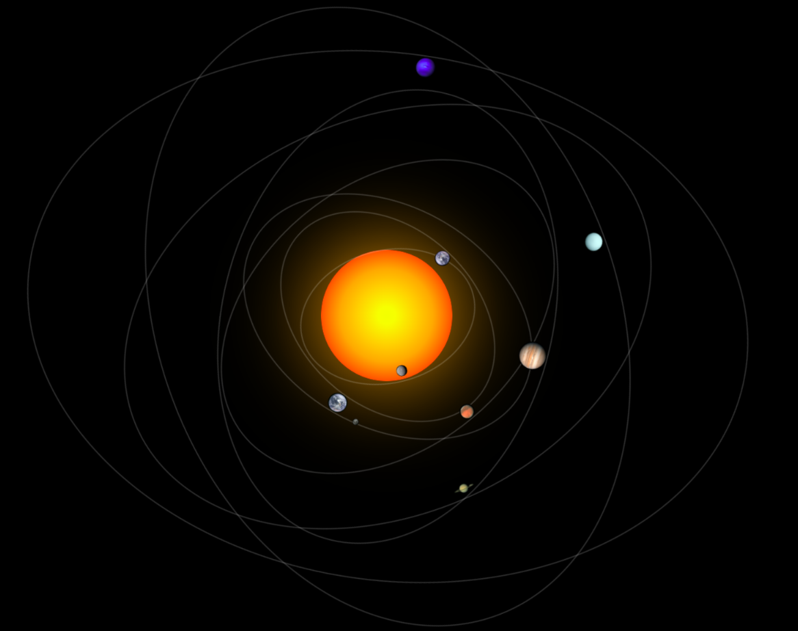

🌞 Solar System Animation

A simple, animated solar system created using HTML and CSS, showing the Sun, planets, and Earth's moon in motion. Each planet orbits the Sun, and the Moon orbits the Earth.

---

🌌 Features
Animated rotation of planets around the Sun.
Earth's Moon orbits around Earth.
Planet images for better visualization.
Fully responsive layout using CSS.

---

## Technologies Used
HTML5 – for the structure of the solar system.
CSS – for animations, styling, and planet orbits.

---

📁 Project Structure
form/
│
├── index.html        
├── styles/
│   └── styles.css    
└── image/
    ├── mercury.jpg
    ├── vinus.jpg
    ├── earth.jpg
    ├── moon.jpg
    ├── mars.jpg
    ├── jupiter.jpg
    ├── saturn.jpg
    ├── uranus.jpg
    └── neptune.jpg

 ---

 📸 Screenshot
**Full Solar System:**  

 
---

📜 License

This project is open-source and free to use for learning and personal projects.
